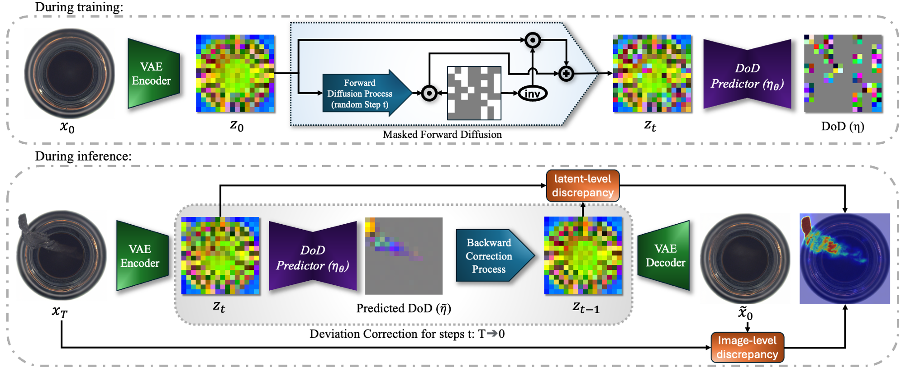
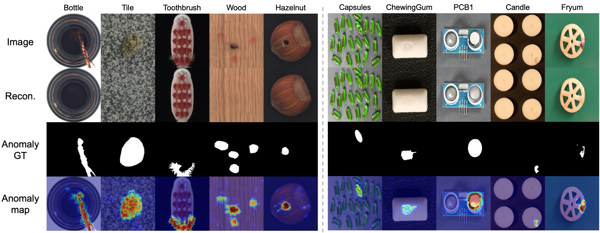

# ✨ DeCo-Diff ✨
**A PyTorch Implementation for Multi-Class Unsupervised Anomaly Detection**

This repository hosts the official PyTorch implementation for our CVPR 2025 paper:  
[**"Correcting Deviations from Normality: A Reformulated Diffusion Model for Unsupervised Anomaly Detection"**.](https://arxiv.org/abs/2503.19357)

---

## 🎨 Approach




---

## 🚀 Getting Started

### 🛠️ Environment Setup

We utilize **Python 3.11** for all experiments. To install the necessary packages, simply run:

```bash
pip3 install -r requirements.txt
```

### 📁 Datasets

Download the datasets below and organize them as shown:
- [MVTec-AD](https://www.mvtec.com/company/research/datasets/mvtec-ad)
- [VisA](https://amazon-visual-anomaly.s3.us-west-2.amazonaws.com/VisA_20220922.tar)

The expected file structure (default for MVTec-AD) is as follows:
```
├── class1
│   ├── ground_truth
│   │   ├── defect1
│   │   └── defect2
│   ├── test
│   │   ├── defect1
│   │   ├── defect2
│   │   └── good
│   └── train
│       └── good
├── class2
...
```

---

## 🏋️ Training

Train our model using the following command. This command sets up the RLR training with various options tailored to your dataset and desired augmentations:

```bash
torchrun train_DeCo_Diff.py \
            --dataset mvtec \
            --data-dir ./mvtec-dataset/ \
            --model-size UNet_L \
            --object-class all  \
            --image-size 288 \
            --center-size 256 \
            --center-crop True \
            --augmentation True 
```

---

## 🧪 Testing

Once the model is trained, test its performance using the command below:

```bash
python evaluation_DeCo_Diff.py \
            --dataset mvtec \
            --data-dir ./mvtec-dataset/ \
            --model-size UNet_L \
            --object-class all  \
            --anomaly-class all  \
            --image-size 288 \
            --center-size 256 \
            --center-crop True \
            --pretrained /path/to/pretrained_weights.pt
```
---

## 📦 Pretrained Weights

For convenience, we provide pretrained weights for DeCo-Diff (UNet_L). These weights can be used for rapid inference and further experimentation:

- **MVTec-AD Pretrained Weights:**  
  Download from [Google Drive](https://drive.google.com/file/d/1M-BQeZxyrXRR911O5Np5pLmd7Ev23EXy/view?usp=share_link) 
  
- **VisA Pretrained Weights:**  
  Download from [Google Drive](https://drive.google.com/file/d/1uNE-Vtb7TPeuMkyepTbKFsxUy8472enx/view?usp=share_link) 

---

## 📊 Results

Below are the performances of DeCo-Diff on the MVTec-AD and VisA datasets. These results illustrate the high efficacy of DeCo-Diff in detecting anomalies in multi-class UAD setting.


|**Dataset**  |I-**AUROC**| I-**AP** |I-**f1max**|P-**AUROC**| P-**AP** |P-**f1max**|P-**AUPRO**|
|-------------|-----------|----------|-----------|-----------|--------|-----------|-----------|
| MVTec-AD   |    99.3    |   99.8   |   98.5    |   98.4    |  74.9  |   69.7    |   94.9    |
| VisA       |    96.4    |   96.8   |   92.2    |   98.5    |  51.3  |   51.2    |   92.1    |

---

## 📸 Sample Results

Below are some sample outputs showcasing the performance of DeCo-Diff on real data:



---

## 📚 Citation & Reference

If you find DeCo-Diff useful in your research, please cite our work:

```bibtex
@article{beizaee2025correcting,
  title={Correcting Deviations from Normality: A Reformulated Diffusion Model for Multi-Class Unsupervised Anomaly Detection},
  author={Beizaee, Farzad and Lodygensky, Gregory A and Desrosiers, Christian and Dolz, Jose},
  journal={arXiv preprint arXiv:2503.19357},
  year={2025}
}
```


